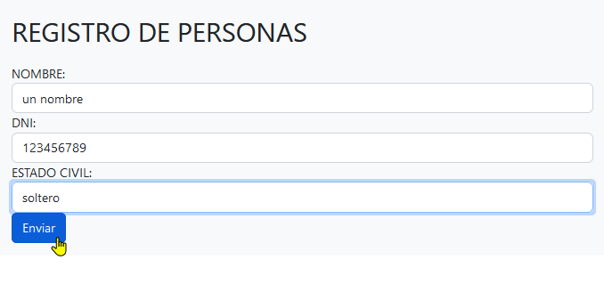
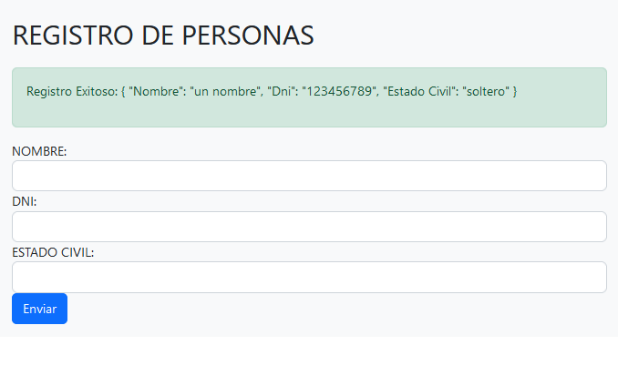

# Taller14

Repositorio de la act. asíncrona: <https://github.com/araceliponce/taller14>   
Live demo de la act. asíncrona: <https://araceliponce.github.io/taller14/>  

Repositorio del reto: <https://github.com/marwingaray/s14>   


# Capturas




## Para tener un live demo:
```
ng add angular-cli-ghpages
```
```
ng deploy --base-href "/nombre-del-repositorio/"
```

por ejm:
```
ng deploy --base-href "/taller14/"
```
